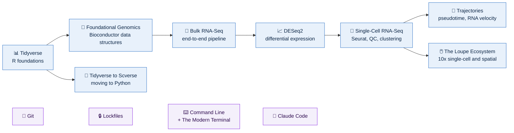
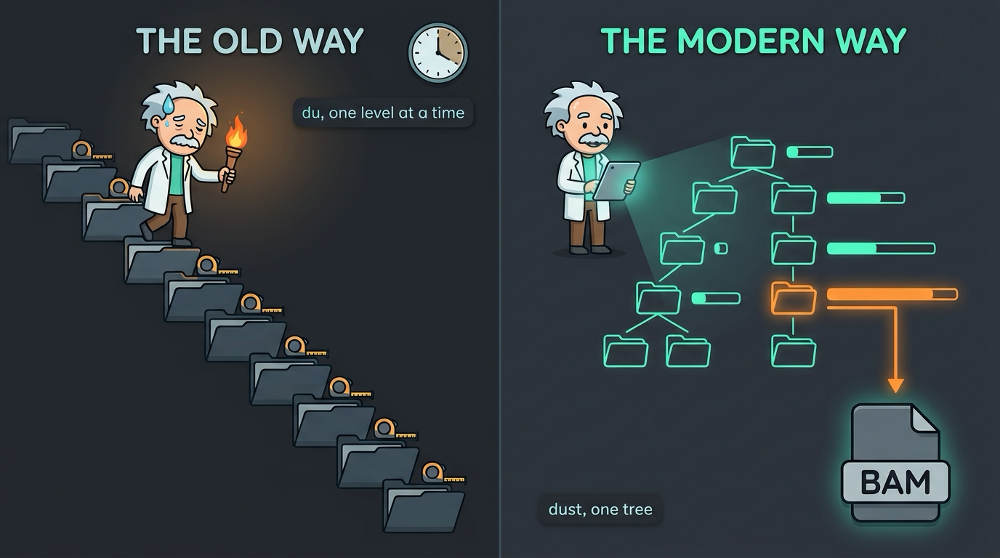
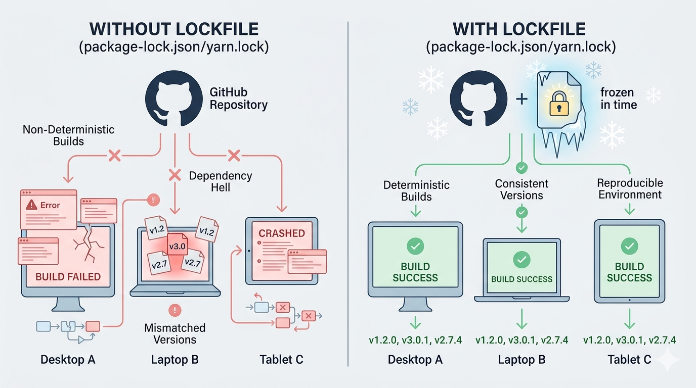
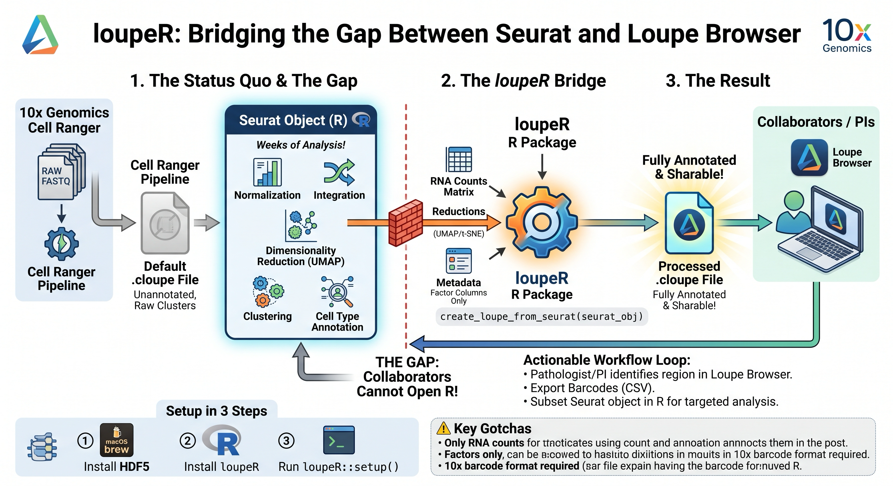
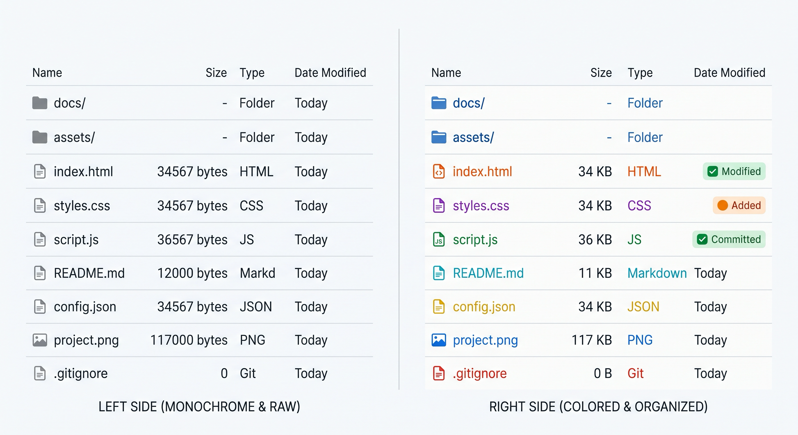
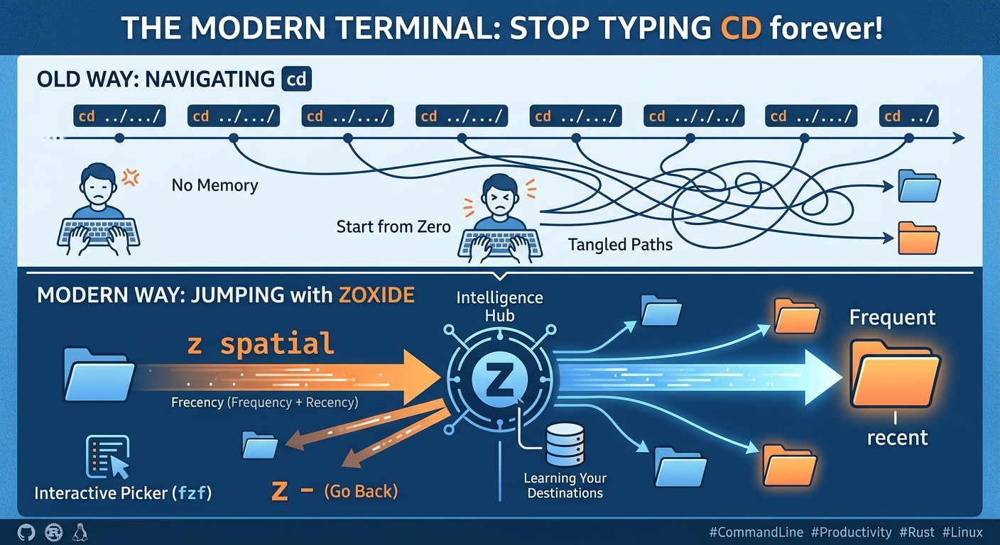
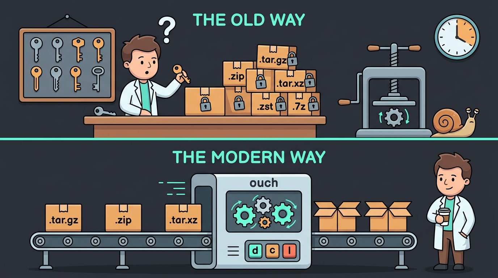

# 🧬 Bioinformatics & Computational Biology Blog

**Tutorial series for biologists who want to run their own analysis**

**Read it at [badran-elshenawy.netlify.app](https://badran-elshenawy.netlify.app/)**

---

## 📌 At a Glance

| | |
|---|---|
| **What** | Tutorial series on single-cell, spatial and bulk RNA-seq, R, Python, and the tools around them |
| **Who it's for** | Biologists who are one clear explanation away from running their own analysis |
| **Approach** | What a tool actually does, where its assumptions hide, and how to use it on real data |
| **Scale** | **114 posts** across 13 series |
| **Author** | [Badran Elshenawy](https://www.linkedin.com/in/dr-badran-m-e-65414b113/), computational biologist at the University of Oxford |

---

## 🗺️ How the Series Fit Together

The analysis series build on each other; the tooling series sit alongside and can be read in any order.

---

## 📚 The Series

### 🧬 Analysis

| Series | Posts | What it covers | Start here |
|---|---:|---|---|
| **Foundational Genomics** | 12 | Biostrings, GenomicRanges, Rle vectors, genome arithmetic, annotation | [Rle vectors](https://badran-elshenawy.netlify.app/posts/genomic-rle-vectors/) |
| **Bulk RNA-Seq** | 10 | An end-to-end bulk RNA-seq pipeline | [Introduction](https://badran-elshenawy.netlify.app/posts/bulk-rna-seq-introduction/) |
| **DESeq2** | 17 | Differential expression from raw counts to results | [Introduction](https://badran-elshenawy.netlify.app/posts/rnaseq-analysis-introduction/) |
| **Single-Cell RNA-Seq** | 15 | Seurat, QC, clustering, differential expression, pathway analysis | [Practice datasets](https://badran-elshenawy.netlify.app/posts/scrna-seq-seuratdata-practice-datasets/) |
| **Trajectories** | 7 | Pseudotime, Monocle3, RNA velocity, PAGA, choosing a method | [The roadmap](https://badran-elshenawy.netlify.app/posts/advanced-scrnaseq-trajectory-intro/) |
| **The Loupe Ecosystem** | 3 | 10x Loupe Browser, `.cloupe` files and `loupeR` | [Point-and-click EDA](https://badran-elshenawy.netlify.app/posts/loupe-ecosystem-post-1-point-and-click-eda/) |

### 💻 Languages

| Series | Posts | What it covers | Start here |
|---|---:|---|---|
| **Tidyverse** | 14 | Data wrangling, ggplot2, purrr, functional programming in R | [Why the tidyverse](https://badran-elshenawy.netlify.app/posts/tidyverse-intro/) |
| **Tidyverse to Scverse** | 7 | Moving single-cell work from R to Python: uv, Quarto, marimo, Polars | [Why I'm switching](https://badran-elshenawy.netlify.app/posts/tidyverse-to-scverse-why-switching/) |

### 🛠️ Tools and Reproducibility

| Series | Posts | What it covers | Start here |
|---|---:|---|---|
| **Git** | 8 | Version control for researchers | [Why you need Git](https://badran-elshenawy.netlify.app/posts/git-version-control-part1/) |
| **Lockfiles** | 2 | Reproducible environments with `uv.lock` and `renv.lock` | [The missing layer](https://badran-elshenawy.netlify.app/posts/lockfiles-reproducibility-layer/) |
| **Command Line** | 3 | Terminal essentials for bioinformaticians | [dust and lsd](https://badran-elshenawy.netlify.app/posts/cli-tools-dust-lsd/) |
| **The Modern Terminal** | 4 | Modern replacements for the core CLI tools: `eza`, `zoxide`, `dust`, `ouch` | [eza](https://badran-elshenawy.netlify.app/posts/modern-terminal-post-1-eza/) |
| **Claude Code** | 9 | AI-assisted research: skills, MCPs, subagents, plugins | [Skills](https://badran-elshenawy.netlify.app/posts/claude-skills-turn-claude-into-your-specialist/) |

Plus 3 standalone posts, on VS Code and Quarto visual mode, the tidyverse transition, and where it all started.

---

## 🧭 Where to Start

| If you want to... | Read |
|---|---|
| 🔬 Analyse your first single-cell dataset | **Single-Cell RNA-Seq**, then **Trajectories** |
| 📈 Find differentially expressed genes in bulk data | **Bulk RNA-Seq**, then **DESeq2** |
| 📊 Get comfortable in R first | **Tidyverse**, then **Foundational Genomics** |
| 🐍 Move your analysis to Python | **Tidyverse to Scverse** |
| 🖱️ Explore 10x data without code | **The Loupe Ecosystem** |
| 🔁 Make your analysis reproducible | **Git**, then **Lockfiles** |
| ⌨️ Work faster on a cluster | **Command Line**, then **The Modern Terminal** |
| 🤖 Use AI in your research workflow | **Claude Code** |

---

## 🖼️ What the Posts Look Like

### A workflow shift

Each series post carries one infographic that has to make its point without the surrounding text.

  

### A tool, old versus new

The command-line series compare the classic tool with its modern replacement, one tool per post.

  

<b>📊 More figures: lockfiles, the Loupe ecosystem, eza, zoxide, ouch</b>

#### Builds without and with a lockfile

#### loupeR turns a Seurat object into a shareable .cloupe

#### The same directory listed by ls and by eza

#### cd one level at a time versus zoxide jumping by frecency

#### One tool and one syntax for every archive format

---

## 📄 License

Blog content © Badran Elshenawy. The Hugo Coder theme is licensed under the [MIT License](https://github.com/luizdepra/hugo-coder/blob/main/LICENSE.md).

---

**Badran Elshenawy** · [Pathania Group](https://www.pathanialab.com/team.html) · Ludwig Institute for Cancer Research, University of Oxford

