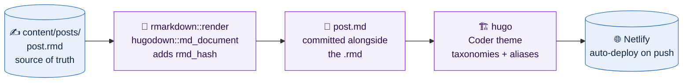

<div align="center">

# 🧬 Bioinformatics & Computational Biology Blog

**Tutorial series on single-cell, spatial and bulk RNA-seq, R, Python, and the command line**


**Live at [badran-elshenawy.netlify.app](https://badran-elshenawy.netlify.app/)**

</div>

---

## 📌 At a Glance

| | |
|---|---|
| **What** | A tutorial-driven blog for biologists who analyse their own data |
| **Why** | Most biologists are one clear explanation away from running their own analysis |
| **Author** | [Badran Elshenawy](https://www.linkedin.com/in/dr-badran-m-e-65414b113/), computational biologist at the University of Oxford |
| **Scale** | **114 posts** across 13 series, published since December 2024 |
| **Source format** | R Markdown, rendered to markdown with `hugodown`: both files committed |
| **Stack** | Hugo + Coder theme, auto-deployed on push to `main` |

---

## 🗺️ How a Post Gets Published



| Step | What happens | Status |
|:---:|---|:---:|
| 01 | Write `content/posts/{series}_part_{NN}.rmd` with YAML front matter | ✅ |
| 02 | Render to `.md`; `rmd_hash` is added automatically | ✅ |
| 03 | Commit both files, update this README's series counts | ✅ |
| 04 | Push to `main`; Netlify builds and publishes | ✅ |

> [!NOTE]
> Posts dated in the future stay invisible until the next push, because Netlify only builds when something lands on `main`.

---

## 📚 Tutorial Series

| Series | Posts | Topics |
|---|---:|---|
| **DESeq2** | 17 | Differential expression from raw counts to results |
| **Single-Cell RNA-Seq** | 15 | Seurat, QC, clustering, DEA, pathway analysis |
| **Tidyverse** | 14 | Data wrangling, ggplot2, purrr, functional programming in R |
| **Foundational Genomics** | 12 | Biostrings, GenomicRanges, genome arithmetic, annotation |
| **Bulk RNA-Seq** | 10 | End-to-end bulk RNA-seq pipeline |
| **Claude Code** | 9 | `CLAUDE.md`, skills, MCPs, subagents, plugins |
| **Git** | 8 | Version control for researchers |
| **Trajectories** | 7 | Pseudotime, Monocle3, RNA velocity, PAGA, method selection |
| **Tidyverse to Scverse** | 7 | Moving from R/tidyverse to Python/scverse for single-cell work |
| **The Modern Terminal** | 4 | Rust replacements for the core CLI tools: `eza`, `zoxide`, `dust`, `ouch` |
| **Command Line** | 3 | Terminal essentials for bioinformaticians |
| **The Loupe Ecosystem** | 3 | 10x Loupe Browser, `.cloupe` files and `loupeR` |
| **Lockfiles** | 2 | Reproducible environments with `uv.lock` and `renv.lock` |
| **Standalone** | 3 | VS Code and Quarto visual mode, the tidyverse transition, the first post |
| **Total** | **114** | |

---

## 🔑 Key Design Decisions

> [!IMPORTANT]
> **The `.rmd` is the source of truth; the `.md` is generated.** Editing a `.md` directly works until the next render silently overwrites it. Always edit the `.rmd` and re-render.

| Decision | Rationale |
|---|---|
| 📝 **R Markdown over plain markdown** | Posts can execute R, so code output in a tutorial is real output rather than something retyped by hand |
| 👯 **Both `.rmd` and `.md` committed** | Netlify builds with Hugo alone and never runs R, so the rendered markdown has to be in the repo |
| 🖼️ **Alt text written as a caption** | The theme renders alt text as a visible `<figcaption>`, so it is one short line, not a description of the picture |
| 🔗 **Slugs with hyphens, aliases with underscores** | Older posts were published under underscored URLs; aliases keep those links alive |
| 🎨 **Theme as a git submodule** | `themes/Coder/` is upstream code, so customisation lives in config rather than in edits that would be lost |
| 🗂️ **`{series}_part_{NN}` filenames** | Numeric ordering that survives a directory listing, and makes the next post in a series obvious |

---

## 🖼️ What the Posts Look Like

### Explaining a workflow shift

Each series post carries one infographic that has to make its point without the surrounding text.

<p align="center">
  
</p>

### Explaining a tool

The command-line series compares the classic tool with its modern replacement, one tool per post.

<p align="center">
  
</p>

<details>
<summary><b>📊 More figures: lockfiles, the Loupe ecosystem, eza, zoxide, ouch</b></summary>

#### Builds without and with a lockfile


#### loupeR turns a Seurat object into a shareable .cloupe


#### The same directory listed by ls and by eza


#### cd one level at a time versus zoxide jumping by frecency


#### One tool and one syntax for every archive format


</details>

---

## 📁 Repository Layout

```
my_website/
├── 📄 readme.md
├── ⚙️ hugo.toml                    # site metadata, social links, nav, taxonomies
├── 🚀 netlify.toml                 # build command and pinned Hugo version
├── 🧭 archetypes/default.md        # new-post template
├── 📓 content/
│   ├── about.md                    # the About page
│   └── posts/
│       ├── *.rmd                   # source of truth, 113 files
│       ├── *.md                    # rendered output, 114 files
│       └── images/                 # post infographics (PNG)
├── 🖼️ static/images/               # avatar and site-wide images
├── 🎨 themes/Coder/                # git submodule: never edited directly
├── 🏗️ public/                      # committed Hugo build output
│
│   ── not tracked (local only) ──────────────────────────
├── CLAUDE.md                       # working notes for Claude Code
├── AGENTS.md                       # agent instructions
├── docs/                           # scratch
└── repo-history-backup.bundle      # local history backup
```

> [!NOTE]
> One post predates the dual-file convention, which is why there is one more `.md` than `.rmd`.

---

## 🚀 Running It Locally

```bash
# 1. Clone with the theme submodule
git clone --recurse-submodules https://github.com/wolf5996/my_website.git
cd my_website

# 2. Serve locally at http://localhost:1313
hugo server        # published posts only
hugo server -D     # include drafts

# 3. Write a post, then render it (requires R)
Rscript -e 'rmarkdown::render("content/posts/my_post.rmd", output_format = hugodown::md_document())'

# 4. Build for production
hugo
```

Rendering is per-post, so editing one post never requires rebuilding the others.

---

## 📦 Dependencies

| Area | Tools |
|---|---|
| 🏗️ Site | [`hugo`](https://gohugo.io/) (extended), [`hugo-coder`](https://github.com/luizdepra/hugo-coder) |
| ✍️ Authoring | [`hugodown`](https://github.com/r-lib/hugodown), `rmarkdown`, `knitr`, `pandoc` |
| 🚀 Deploy | [Netlify](https://www.netlify.com/), building on every push to `main` |

---

## ✍️ Post Conventions

<details>
<summary>Front matter and formatting rules used across posts</summary>

- **Front matter**: YAML with `---` delimiters; `title`, `author`, `date`, `categories`, `tags`, `description`, `slug`, `draft`, `output`, `summary`
- **Dates**: ISO 8601 with time and zone, e.g. `2026-09-23T09:00:00Z`
- **Filenames**: underscores and zero-padded numbers, `{series}_part_{NN}.rmd`
- **Slugs**: hyphenated; `aliases` keep the older underscored URLs working
- **Lists**: always preceded by a blank line, or pandoc collapses them into one horizontal line
- **Bullet labels**: `**term:** description`, not an em dash
- **Captions**: one short line, because alt text renders as a visible caption
- **Commit messages**: lowercase, `{series} post {N}: {topic}`

</details>

---

## 📄 License

Blog content © Badran Elshenawy. The Hugo Coder theme is licensed under the [MIT License](https://github.com/luizdepra/hugo-coder/blob/main/LICENSE.md).

---

<div align="center">

**Badran Elshenawy** · [Pathania Group](https://www.pathanialab.com/team.html) · Ludwig Institute for Cancer Research, University of Oxford

</div>
